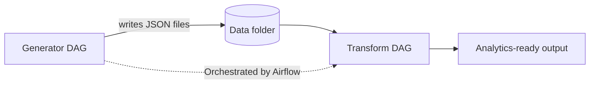

# Real-Time Sales Analytics (Airflow + dbt demo)

A minimal, recruiter-ready project that simulates a real-time pipeline using **Airflow** to generate events and run a toy transform. Designed to be pushed to GitHub and run locally with Docker.

## Architecture


## Quickstart

### 1) Start Airflow (Docker)
```bash
docker-compose up -d
```

- Airflow Web UI: http://localhost:8080  
- Login: `admin` / `admin`

### 2) Enable DAGs
In the Web UI, turn on:
- `generate_events_dag`
- `toy_transform_dag`

### 3) Where data lands
Generated JSON files are written under `airflow/dags/data/`.  
The transform reads them and writes a small summary to `airflow/dags/data/_outputs/`.

> Note: This minimal starter does **not** require Kafka/Snowflake/dbt to run.
You can extend it later.